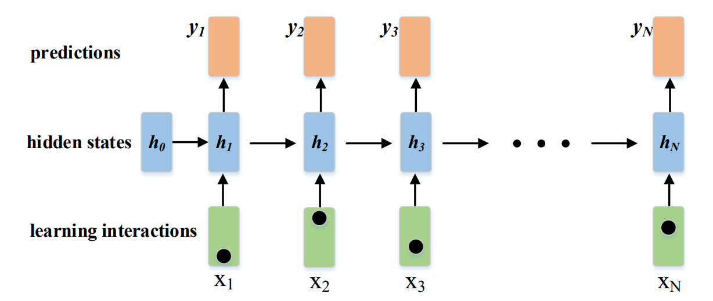

# Deep Knowledge Tracing(DKT)

Deep knowledge tracing (DKT) is the first approach to introduce deep learning into KT, which utilizes recurrent neural networks (RNNs) to model the students’ learning process. DKT applies RNNs to process the input sequence of learning interactions over time, maintaining a hidden state that implicitly represents students' knowledge state which evolves based on both the previous knowledge state and the present input learning interaction. 



The above figure shows the data flow of DKT model. $x_i$ are the input embeddings of students’ learning interactions, $h_i$ are the hidden states that represent students’ knowledge states, and $y_i$ are the predicted answers. The high-dimensional and continuous representation of the knowledge state makes it better able to model the complex learning process. Generally, RNNs’ variant long short term memory (LSTM) networks are more commonly used in the implementation of DKT, which is made more powerful through considering forgetting. We also use LSTM to implement DKT model in our library.


If the reader wants to know the details of DKT, please refer to the paper: *[Deep Knowledge Tracing](http://stanford.edu/~cpiech/bio/papers/deepKnowledgeTracing.pdf)*.
```bibtex
@article{piech2015dkt,
  title={Deep Knowledge Tracing},
  author={Piech, Chris and Spencer, Jonathan and Huang, Jonathan and Ganguli, Surya and Sahami, Mehran and Guibas, Leonidas and Sohl-Dickstein, Jascha},
  volume={1},
  pages={505--513},
  year={2015},
  publisher={NeurIPS: Los Angeles, CA}
}
```