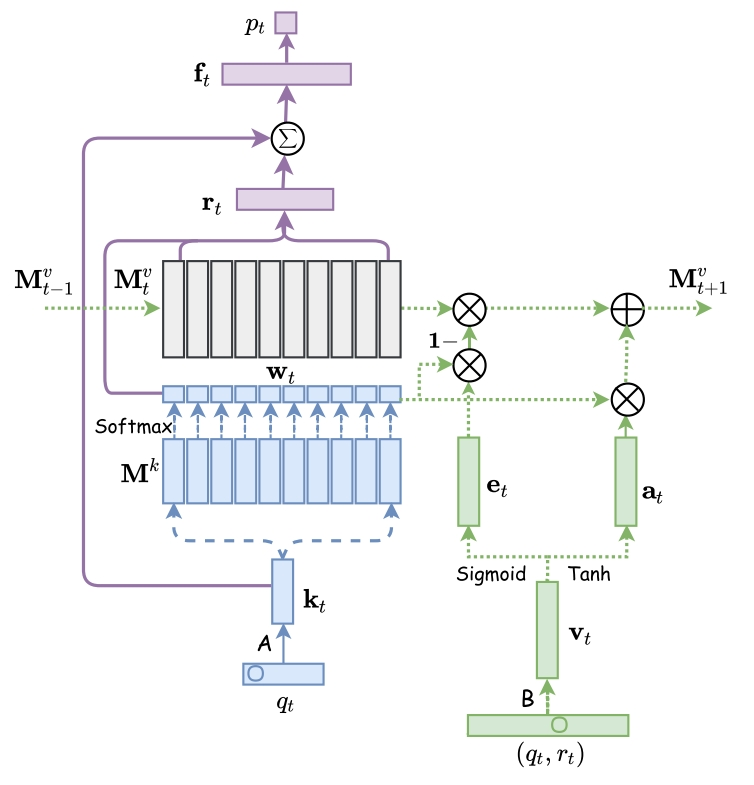

# Dynamic Key-Value Memory Networks for Knowledge Tracing(DKVMN)

## Introduction
Dynamic Key-Value Memory Networks (DKVMN) can exploit the relationships between underlying concepts and directly output a student’s mastery level of each concept. Unlike standard memory-augmented neural networks that facilitate a single memory matrix or two static memory matrices, DKVMN has one static matrix called key, which stores the knowledge concepts and the other dynamic matrix called value, which stores and updates the mastery levels of corresponding concepts. DKVMN initializes a static matrix called a key matrix to store latent KCs and a dynamic matrix called a value matrix to store and update the mastery of corresponding KCs through read and write operations over time. As shown in Model part, an embedding matrix is first defined to obtain the embedding vector $k_t$ of the exercises. A correlation weight $w_t$ is then obtained by taking the inner product between the exercise embedding $k_t$ and the key vectors $M^k$, followed by the softmax activation:

```math
\boldsymbol{w}_t=Softmax\left(k_t M^k\right),
```

where the correlation weight $w_t$ represents the correlation between the exercises and all latent KCs. In the read operation, DKVMN predicts student performance based on the student’s knowledge mastery. Specifically, DKVMN reads students’ mastery of the exercise $r_t$ with reference to the weighted sum of all memory vectors in the value matrix using the correlation weight. The read content and the input exercise embeddings are then concatenated together and passed to a fully connected layer to yield a summary vector $f_t$, which contains both the student’s knowledge mastery and the prior difficulty of the exercise. Furthermore, the student’s performance can be predicted by applying another fully connected layer with a sigmoid activation function to the summary vector:

```math
\begin{aligned}
\boldsymbol{r}_t & =\sum_{i=1}^N w_t(i) M_t^v(i), \\
\boldsymbol{f}_t & =\tanh \left(\boldsymbol{W}_f\left[\boldsymbol{r}_t, k_t\right]+\boldsymbol{b}_f\right), \\
p_t & =\sigma\left(\boldsymbol{W}_p \boldsymbol{f}_t+\boldsymbol{b}_p\right),
\end{aligned}
```

where $W_f$ and $W_p$ are the weights, $b_f$ and $b_p$ are bias terms. In the write operation, after an exercise has been answered, DKVMN updates students’ knowledge mastery (i.e., the value matrix) based on their performance. Specifically, the learning interaction ($e_t$, $a_t$) is first embedded with an embedding matrix $B$ to obtain the student’s knowledge growth $v_t$. Then DKVMN calculates an erase vector $erase_t$ from $v_t$ and decides to erase the previous memory with reference to both the erase vector and the correlation weight $w_t$. Following erasure, the new memory vectors are updated by the new knowledge state and the add vector $add_t$, which forms an erase-followed-by-add mechanism that allows forgetting and strengthening knowledge mastery in the learning process:

```math
\begin{aligned}
& \text { erase }_t=\sigma\left(\boldsymbol{W}_e \boldsymbol{v}_t+\boldsymbol{b}_e\right), \\
& \widetilde{M}_t^v(i)=M_{t-1}^v(i)\left[1-w_t(i) \text { erase }_t\right], \\
& \boldsymbol{a d d}_t=\tanh \left(\boldsymbol{W}_d \boldsymbol{v}_t+\boldsymbol{b}_d\right), \\
& M_t^v(i)=\widetilde{M}_t^v(i)+w_t(i) \boldsymbol{a d d}_t,
\end{aligned}
```

where $W_e$ and $W_d$ are the weights, $b_e$ and $b_d$ are bias terms.


## Model




If the reader wants to know the details of DKVMN, please refer to the Appendix of the paper: *[Dynamic Key-Value Memory Networks for Knowledge Tracing](https://arxiv.org/pdf/1611.08108v1.pdf)*.

```bibtex
@inproceedings{10.1145/3038912.3052580,
author = {Zhang, Jiani and Shi, Xingjian and King, Irwin and Yeung, Dit-Yan},
title = {Dynamic Key-Value Memory Networks for Knowledge Tracing},
year = {2017},
isbn = {9781450349130},
publisher = {International World Wide Web Conferences Steering Committee},
address = {Republic and Canton of Geneva, CHE},
url = {https://doi.org/10.1145/3038912.3052580},
doi = {10.1145/3038912.3052580},
booktitle = {Proceedings of the 26th International Conference on World Wide Web},
pages = {765–774},
numpages = {10},
keywords = {massive open online courses, knowledge tracing, dynamic key-value memory networks, deep learning},
location = {Perth, Australia},
series = {WWW '17}
}
```

