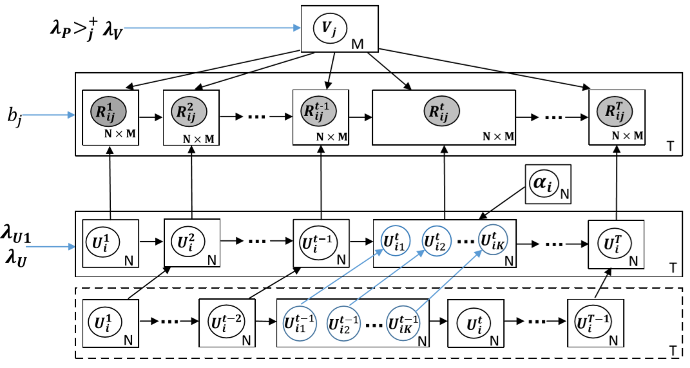
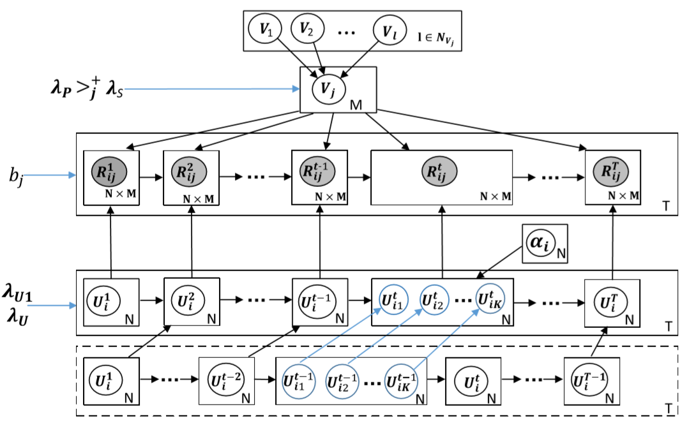

# Knowledge Proficiency Tracing model (KPT) and Exercise-correlated KPT (EKPT)


If the reader wants to know the details of KPT and EKPT, please refer to the Chapter 4 and 5 of the paper: *[Learning or Forgetting? A Dynamic Approach for Tracking the Knowledge Proficiency of Students](http://staff.ustc.edu.cn/~huangzhy/files/papers/ZhenyaHuang-TOIS2020.pdf)*.
```bibtex
@article{huang2020learning,
  title={Learning or forgetting? A dynamic approach for tracking the knowledge proficiency of students},
  author={Huang, Zhenya and Liu, Qi and Chen, Yuying and Wu, Le and Xiao, Keli and Chen, Enhong and Ma, Haiping and Hu, Guoping},
  journal={ACM Transactions on Information Systems (TOIS)},
  volume={38},
  number={2},
  pages={1--33},
  year={2020},
  publisher={ACM New York, NY, USA}
}
```



