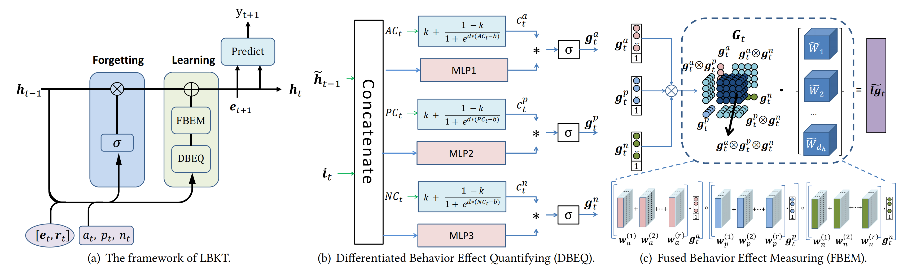

# Learning Behavior-oriented Knowledge Tracing(LBKT)

The LBKT model tracks learners' knowledge states by capturing their multiple learning behaviors' complex effects on the learning and forgetting process. The paper summarize three typical behaviors as **Speed**, **Attempts**, **Hints** and investigate their effects.




The Differentiated Behavior Effect Quantifying module (shown in Figure (b)) and  Fused Behavior Effect Measuring module (shown in Figure (c)) capture the distinctive and fused effect of behaviors on learners’ knowledge acquisition respectively. And a forget gate is designed to combine the forgetting factor with the behavior affected knowledge acquisition to update learners’ knowledge state. 


If the reader wants to know the details of LBKT, please refer to the paper: *[Learning Behavior-oriented Knowledge Tracing](https://dl.acm.org/doi/abs/10.1145/3580305.3599407)*.
```bibtex
@inproceedings{xu2023learning,
  title={Learning Behavior-oriented Knowledge Tracing},
  author={Xu, Bihan and Huang, Zhenya and Liu, Jiayu and Shen, Shuanghong and Liu, Qi and Chen, Enhong and Wu, Jinze and Wang, Shijin},
  booktitle={Proceedings of the 29th ACM SIGKDD Conference on Knowledge Discovery and Data Mining},
  pages={2789--2800},
  year={2023}
}
```